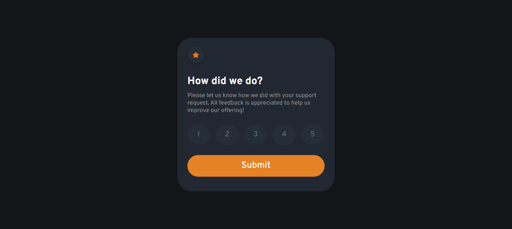

# Frontend Mentor - Interactive rating component solution

This is a solution to the [Interactive rating component challenge on Frontend Mentor](https://www.frontendmentor.io/challenges/interactive-rating-component-koxpeBUmI). Frontend Mentor challenges help you improve your coding skills by building realistic projects.

## Table of contents

- [Overview](#overview)
  - [The challenge](#the-challenge)
  - [Screenshot](#screenshot)
- [My process](#my-process)
  - [Built with](#built-with)
- [Author](#author)

## Overview

### The challenge

Users should be able to:

- View the optimal layout for the app depending on their device's screen size
- See hover states for all interactive elements on the page
- Select and submit a number rating
- See the "Thank you" card state after submitting a rating

### Screenshot

## My process

First I wrote html markup using Emmet abbreviation, then css styles and media queries and lastly javascript code

### Built with

- Semantic HTML5 markup
- Flexbox
- CSS Grid
- Javascipt

## Author

- GitHub - [Giorgi Jobava](https://github.com/GeoStrong)
- Frontend Mentor - [@GeoStrong](https://www.frontendmentor.io/profile/GeoStrong)
- Instagram - [@gio.jobava\_](https://www.instagram.com/gio.jobava_/)
